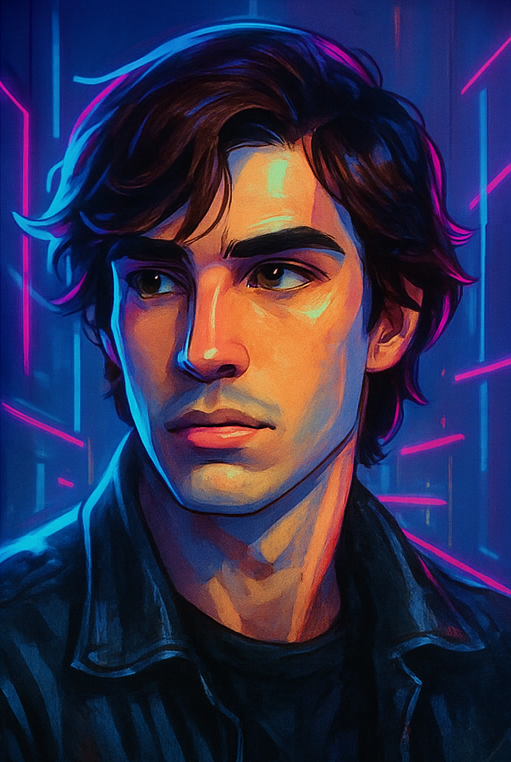

 

  
  

 
<table>
  <tr>
    <td></td>
    <td>
      <h3>Sobre mim</h3>
      Olá! Sou <strong>Marcos Simões</strong>,  monitor e desenvolvedor Full-Stack na Infinity School (Belo Horizonte). 
      Atuo diretamente no apoio técnico e pedagógico a alunos, transformando desafios em soluções práticas através de mentorias, workshops e minicursos. 
      Apaixonado por tecnologia e educação, desenvolvo projetos completos — do front-end ao back-end — sempre focando em performance, boas práticas e experiência do usuário. 
      Aqui você encontra meus projetos pessoais, dicas de carreira, conteúdos práticos, e muito código em constante evolução.
      Estou sempre buscando compartilhar conhecimento e contribuir com a comunidade tech. 
      <strong>Fique à vontade para explorar, conectar-se e colaborar!</strong>
    </td>
  </tr>
</table>

  

DevWizard por vocação, Full-Stack por paixão.
Sou movido pela vontade de ver quem está começando crescer com confiança e propósito.

  
  
### 
Aqui, a magia acontece! 💻✨ Explore minhas ideias, projetos pessoais e muito código que está sempre evoluindo. 🚀

  

### 🔭 **O que você vai encontrar aqui**:  
- **Projetos pessoais**: de front-end a back-end, sempre inovando.  
- **Projetos de monitoria**: soluções que ajudo a desenvolver com meus alunos.  
- **Dicas e aprendizados**: insights que compartilho com a comunidade de desenvolvimento.  

💡 **Sinta-se à vontade para explorar, contribuir ou simplesmente aprender!**

---
## My Skill Set 

  
  
  
  
  
  
  
  
  
   
   
  
  
  
  
  
  
  
  

### 🌐 **Conecte-se comigo**  

  
  
  
   

---
