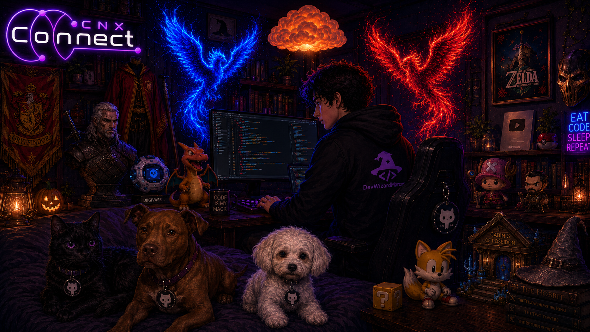

<div align="center">



<br>

                                                                                                                                                                                                                                                                                                                                                                                                                                                                                                                                                                                                                                                                                                                                                                                                                              

<p>
Transformando ideias em experiências digitais através de tecnologia, automação e design.
</p>

<br>
<br><br>

<a href="https://www.linkedin.com/in/marcos-simoes-ms/">
  
</a>

<a href="mailto:mp718887@gmail.com">
  
</a>

<a href="https://instagram.com/darckwolf787">
  
</a>

<a href="https://discord.gg/mp6437">
  
</a>

</div>

---

# Sobre Mim


```bash
> initializing profile...

{
  "user": "Marcos Simões",
  "role": "Front-End Developer",
  "company": "CNX Connect",

  "skills": [
    "Web Development",
    "Automation",
    "Artificial Intelligence",
    "Scalable Systems",
    "Creative Design"
  ],

  "status": {
    "learning": "ADS • Desenvolvimento de Sistemas",
    "building": "Creative Full Stack Projects",
    "mentoring": true,
    "coffee_level": "99%"
  },

  "interests": [
    "Geek Culture",
    "Gaming",
    "Technology",
    "Digital Experiences"
  ]
}

> system ready...
```


<br clear="both"/>

---

# Stack & Ferramentas

<div align="center">

<table>
<tr>
<td align="center" width="50%">

## Frontend

<br>


<br>

</td>

<td align="center" width="50%">

## Backend & Database

<br>


<br><br>


</td>
</tr>

<tr>
<td align="center" width="50%">

## Ferramentas

<br>


<br>

</td>

<td align="center" width="50%">

## 🎨 Design & Produtividade

<br>


<br>

</td>
</tr>
</table>

</div>


